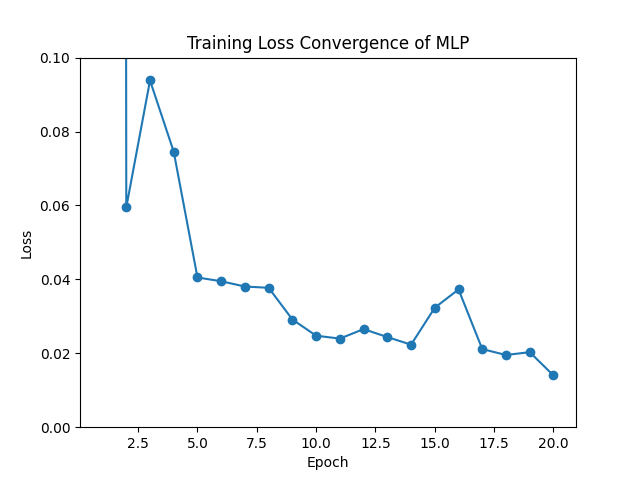
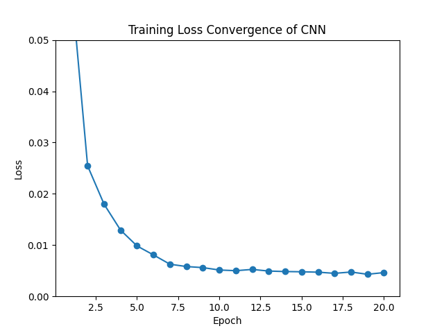
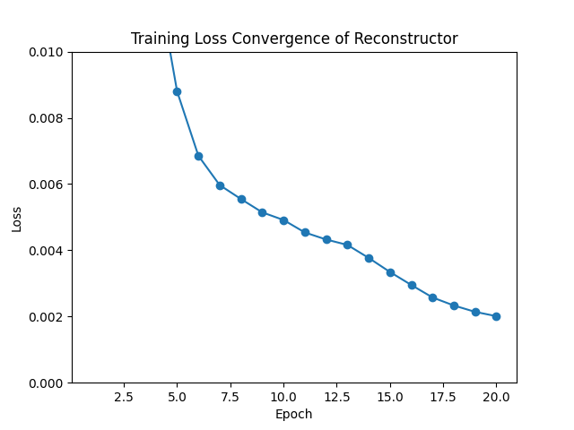

# Homework 1 - CMPE591

**Author:** Gokay Temizkan

**Course:** CMPE591 - Deep Learning in Robotics

**Semester:** Spring 2025

**Instructor:** Emre Ugur, Ph.D.

## Overview
This project involves training and evaluating three different neural network models, a Multi-Layer Perceptron (MLP), a Convolutional Neural Network (CNN), and a reconstructor model utilizing CNN to estimate the object's position given the executed action and the state (a top-down view of the environment).

## Environment Files
- `environment.py`: Contains the simulation environment details (not modified).
- `homework1.py`: Contains the main script to run the environment (not modified).
- `hw1_sampler.py`: Contains the script to generate sample data for training and testing. 
- `README.md`: This README file.

## Data
The data used for training and evaluation is stored in the following directories:
- `hw1_sample/`: Contains the training data.
- `hw1_test/`: Contains the test data.

Each dataset includes:
- `positions_*.pt`: The target positions.
- `actions_*.pt`: The actions taken.
- `imgsBefore_*.pt`: The images before the actions were taken.
- `imgsAfter_*.pt`: The images after the actions were taken.

## Important Note
Error:

OMP: Error #15: Initializing libiomp5md.dll, but found libiomp5md.dll already initialized.
OMP: Hint This means that multiple copies of the OpenMP runtime have been linked into the program. That is dangerous, since it can degrade performance or cause incorrect results. The best thing to do is to ensure that only a single OpenMP runtime is linked into the process, e.g. by avoiding static linking of the OpenMP runtime in any library. As an unsafe, unsupported, undocumented workaround you can set the environment variable KMP_DUPLICATE_LIB_OK=TRUE to allow the program to continue to execute, but that may cause crashes or silently produce incorrect results. For more information, please see http://www.intel.com/software/products/support/.

Solution for Windows:

$env:KMP_DUPLICATE_LIB_OK="TRUE"

## Part 1

### Train
```bash
python .\hw1_1.py --mode train
```
### Test
```bash
python .\hw1_1.py --mode test
```

#### Test Output
```bash
Average Evaluation Loss for MLP: 0.0155
```
The loss plot to show the convergence of the MLP model:



---

## Part 2:

### Train
```bash
python .\hw1_2.py --mode train
```
### Test
```bash
python .\hw1_2.py --mode test
```

#### Test Output
```bash
Average Evaluation Loss for CNN: 0.0040
```

The loss plot to show the convergence of the CNN model:



---

## Part 3:

### Train
```bash
python .\hw1_2.py --mode train
```
### Test
```bash
python .\hw1_2.py --mode test
```

#### Test Output
```bash
Average Evaluation Loss for Reconstructor: 0.0020
```

The loss plot to show the convergence of the Reconstructor model:



Model outputs side-by-side with the original outputs:


