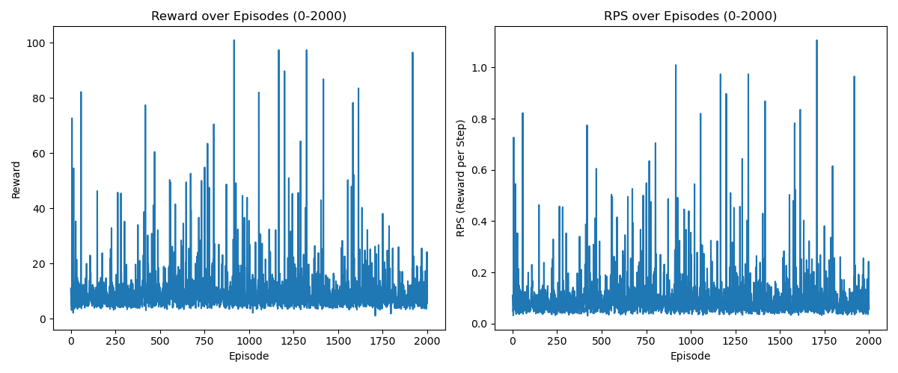

# Homework 2 - CMPE591

**Author:** Gokay Temizkan

**Course:** CMPE591 - Deep Learning in Robotics

**Semester:** Spring 2025

# Overview
This project implements a Deep Q-Learning (DQN) algorithm to train an agent to interact with the `Hw2Env` environment. The agent learns to maximize its cumulative reward over a series of episodes.

## Project Structure
- `hw2.py`: Contains the main training loop and supporting functions for the DQN algorithm.
- `homework2.py`: Contains the definition of the `Hw2Env` environment.
- `policy_net.pth` and `target_net.pth`: Saved models for the policy and target networks.
- `training_progress.json`: Stores the training progress, including the last episode, rewards list, and reward per step (RPS) list.
- `rewards_and_rps.png`: Plot of rewards and RPS over episodes.

## Dependencies
- Python 3.9
- NumPy
- PyTorch
- Matplotlib

You can install the required dependencies using:
```bash
pip install numpy torch matplotlib
```

## Training the Agent
The training process involves the following steps:

1. **Initialize the Environment and Networks**: The `Hw2Env` environment and the policy and target networks are initialized.
2. **Load Saved Models**: If previously saved models exist, they are loaded.
3. **Set Target Network to Evaluation Mode**: The target network is set to evaluation mode to prevent it from being updated during training.
4. **Initialize Optimizer and Replay Memory**: The optimizer and replay memory are initialized.
5. **Load Training Progress**: If a training progress file exists, it is loaded to resume training from the last saved episode.
6. **Main Training Loop**: For each episode:
   - The environment is reset to get the initial state.
   - Actions are selected using an epsilon-greedy policy.
   - Transitions are stored in replay memory.
   - The model is optimized every `UPDATE_FREQ` steps.
   - The target network is updated every `TARGET_NETWORK_UPDATE_FREQ` steps.
   - Epsilon is decayed to reduce exploration over time.
   - Cumulative reward and RPS are recorded.
   - Models and training progress are saved every 100 episodes.
7. **Save Final Models and Training Progress**: At the end of training, the final models and training progress are saved.
8. **Plot Rewards and RPS**: A plot of rewards and RPS over episodes is generated and saved.

## Running the Training
To start the training, run the following command:
```bash
python hw2.py
```

## Hyperparameters and Neural Network Definition
The hyperparameters and neural network architecture are defined as suggested by Yigit Yildirim. The key hyperparameters include:
- `N_ACTIONS = 8`
- `GAMMA = 0.99`
- `EPSILON = 1.0`
- `EPSILON_DECAY = 0.995`
- `EPSILON_DECAY_ITER = 10`
- `MIN_EPSILON = 0.05`
- `LEARNING_RATE = 0.0001`
- `BATCH_SIZE = 64`
- `UPDATE_FREQ = 10`
- `TARGET_NETWORK_UPDATE_FREQ = 200`
- `BUFFER_LENGTH = 100000`
- `NUM_OF_EPISODES = 10000`

The neural network architecture consists of:
- An input layer with 6 units
- A hidden layer with 64 units and ReLU activation
- An output layer with `n_actions` units

## High-Level State Representation
In the `step` function of the `Hw2Env` environment, a higher-level state representation (`high_level_state`) is used instead of raw pixels. This helps in reducing the complexity of the state space and improves the learning efficiency of the agent.

## Maximum Timesteps
The maximum number of timesteps per episode (`self._max_timesteps`) is set to 100 instead of 50. This allows the agent to interact with the environment for a longer duration in each episode, providing more opportunities to learn and accumulate rewards.

## Test Environment
The `Hw2Env` environment is defined in the homework2.py file. It provides the necessary methods for the agent to interact with the environment, including `reset` and `step`.

### Results
The model is trained for 2000 episodes and cumulative rewards and rewards per step (RPS) is plotted below:



The model trained for 2000 episodes are saved to `target_net_0-2000.pth` and `policy_net_0-2000.pth` files.

### Conclusion
The model is trained with the suggested hyperparameters. At the time, 2000 episodes, the model does not seem to converge.

Previously, I have experiemented the environment with `state()` before changing it to `high_level_state()`, But it did not converge as well with suggested model and parameters. Next, I have tried to train the model with a larger NN and it was performing similar to current network but episodes were taking longer.

I am going to update this section if I can achieve to reach 10000 episodes without my computer crash, which it did several times in my pervious experiments.