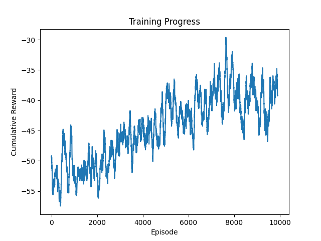
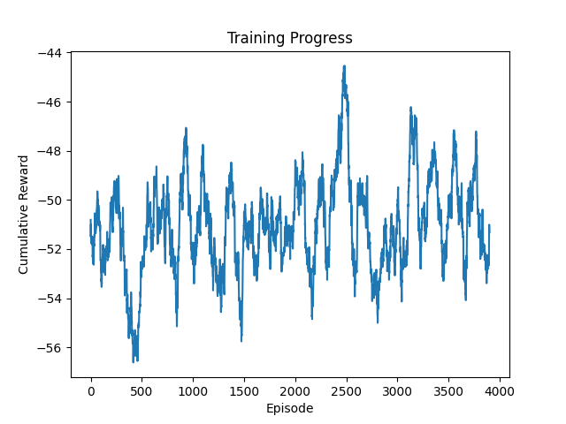
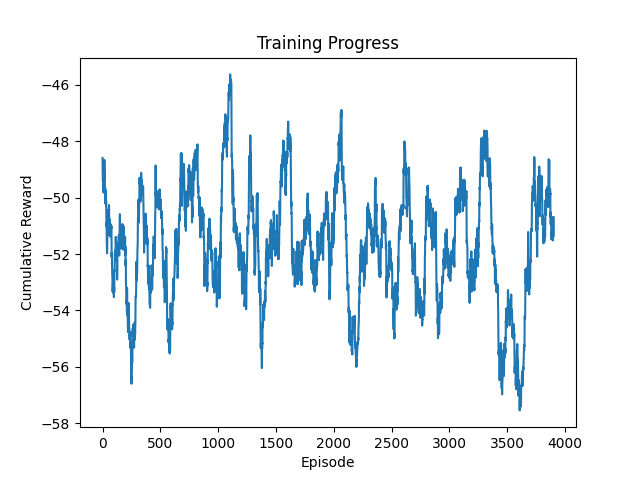
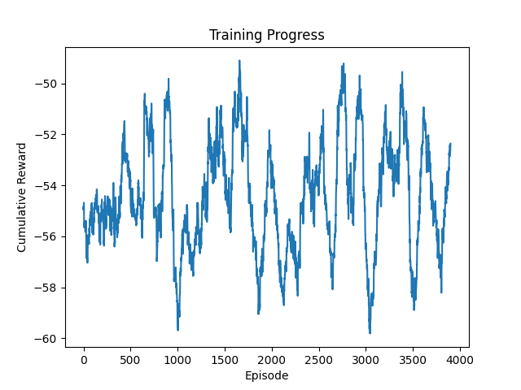
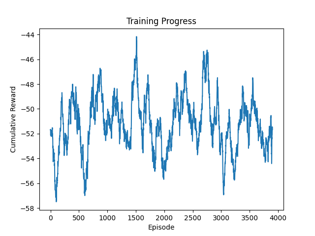

# Homework 2 - CMPE591

**Author:** Gokay Temizkan

**Course:** CMPE591 - Deep Learning in Robotics

**Semester:** Spring 2025

# Overview
This project implements two reinforcement learning algorithms to train an agent to interact with the provided environment:

1. **Vanilla Policy Gradient (REINFORCE)**: A fundamental policy gradient method that directly optimizes the policy by maximizing the expected cumulative reward.

2. **Soft Actor-Critic (SAC)**: An advanced off-policy actor-critic method that incorporates entropy regularization to encourage exploration.

## Project Structure
- `homework3*.py`: Contains the definition of the `Hw3Env` environment. Varying files as implemented that call different models.
- `agent*.py`: Defines various agents that handle different training tasks.
- `model.py`: Provided deep learning model that agents utilize.
- `model*.pt`: The models saved during or after training tasks.
- `rews*.pt`: The revard logs to graph saved during or after training tasks.
- `view_rewards.py`: A simple Python script the visualize reward logs with smoothing. Needs to be updated according to the file name of the log to be visualized and the desired smoothing frame.

## Dependencies
- Python 3.9
- NumPy
- PyTorch
- Matplotlib
- MuJoCo
- dm_control

You can install the required dependencies using:
```bash
pip install numpy torch matplotlib mujoco dm_control
```
More details can be found on [Homeworks](https://cmpe591.github.io/homeworks.html)

## Training the Agent
The training process involves the following steps:

1. **Initialize the Environment and Networks**: The `Hw3Env` environment and the policy and target networks are initialized.
2. **Load Saved Models**: If previously saved models exist, they are loaded.
3. **Set Target Network to Evaluation Mode**: The target network is set to evaluation mode to prevent it from being updated during training.
4. **Initialize Optimizer and Replay Memory**: The optimizer and replay memory are initialized.
5. **Load Training Progress**: If a training progress file exists, it is loaded to resume training from the last saved episode.
6. **Main Training Loop**: The main training loop that handles different RL tasks.
7. **Save Final Models and Training Progress**: At the end of training, the final models and training progress are saved.
8. **Plot Rewards and RPS**: A plot of rewards and RPS over episodes is generated and saved.

## Running the Training
To start the training, run the following command:
```bash
python homework3*.py
```
### Notes
Provided `homework3.py` file is modified for different RL agents and in order to run on UHEM*. Additionally, the functionality to load previous trained models and continue from where it left off is impelemented.

* TR: "T.C. Cumhurbaşkanlığı Strateji ve Bütçe Başkanlığı tarafından desteklenen Ulusal Yüksek Başarımlı Hesaplama Uygulama ve Araştırma Merkezi (UHeM, önceki kısaltmasıyla UYBHM), 2006 yılından bu yana yüksek başarımlı hesaplama ve veri depolama alanlarında hem akademik hem de endüstriyel kullanıcılara hizmet vermektedir."

### Results

#### Vanilla Policy Gradient Implementation (REINFORCE)
Related files:
- `homework3_uhem.py` (Tested on UHEM)
- `agent2.py`
- `model_uhem_10000.pt` (Trained model)
- `rews_uhem_10000.py` (Reward logs)
- `hw3_01.sh` (Slurm job)

To start the training, run the following command:
```bash
python homework3_uhem.py
```


#### Soft Actor Critic Implementation
Four different agents are trained simultanously on UHEM:
- `hw3_soc_01-4.sh` (Slurm job)

!!!IMPORTANT NOTE!!!
I cannot access UHEM with "authentication failed" error at the time I submit the homework and I do not have time to resolve the issue before the deadline. Thus, I cannot get the complete results of the training but I have shared below the training tasks up to 4000 episodes which I saved to my local before.

!!!UPDATE!!!
I was able to run them again for 10000 episodes each but no learning is achieved, thus the output below is not updated.

##### Training 1
Related files:
- `homework3_soc_uhem_01.py` (Tested on UHEM)
- `agent_soc_uhem_01.py`
- `model_soc_uhem_01_4000.pt` (Trained model)
- `rews_soc_uhem_01_4000.py` (Reward logs)

To start the training, run the following command:
```bash
python homework3_soc_uhem_01.py
```



##### Training 2
Related files:
- `homework3_soc_uhem_02.py` (Tested on UHEM)
- `agent_soc_uhem_02.py`
- `model_soc_uhem_02_4000.pt` (Trained model)
- `rews_soc_uhem_02_4000.py` (Reward logs)

To start the training, run the following command:
```bash
python homework3_soc_uhem_02.py
```



##### Training 3
Related files:
- `homework3_soc_uhem_03.py` (Tested on UHEM)
- `agent_soc_uhem_03.py`
- `model_soc_uhem_03_4000.pt` (Trained model)
- `rews_soc_uhem_03_4000.py` (Reward logs)

To start the training, run the following command:
```bash
python homework3_soc_uhem_03.py
```



##### Training 4
Related files:
- `homework3_soc_uhem_04.py` (Tested on UHEM)
- `agent_soc_uhem_04.py`
- `model_soc_uhem_04_4000.pt` (Trained model)
- `rews_soc_uhem_04_4000.py` (Reward logs)

To start the training, run the following command:
```bash
python homework3_soc_uhem_04.py
```
