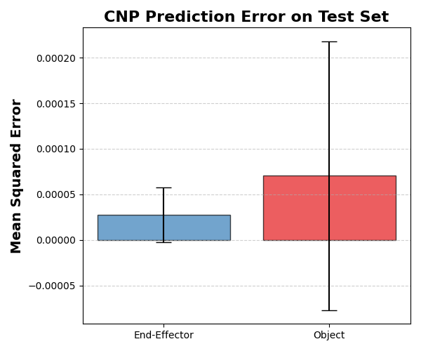

# Homework 4 - CMPE591

**Author:** Gokay Temizkan

**Course:** CMPE591 - Deep Learning in Robotics

**Semester:** Spring 2025

# Overview

This homework involves collecting demonstrations consisting of (t, ey, ez, oy, oz), where `e` and `o` represent the end-effector and object cartesian coordinates, respectively. The robot moves its end-effector randomly in the y-z plane, with the object's height also randomized and provided by the environment.

A Conditional Neural Process (CNMP) is trained on a dataset of tuples {(t, ey, ez, oy, oz)<sub>i</sub>, h<sub>i</sub>}<sup>N</sup><sub>i=0</sub>, where `h` is the object's height. The model is conditioned on time and object height to predict end-effector and object positions, using several context points for conditioning.

# Project Structure & Submission

- `homework4.py`: Main script that defines the environment and the model.
- `collect_demos.py`: Script to collect and save demonstration data.
- `train_cnp.py`: Script to train the CNMP model on the collected demonstrations.
- `test_cnp.py`: Script to test the trained CNMP model and evaluate its performance.
- `demos.npz`: Saved demonstration dataset for training.
- `demos_test.npz`: Saved demonstration dataset for testing.
- `cnp_model.pth`: Trained CNMP model.
- `test_plot.png`: Bar plot showing the mean and standard deviation of the mean squared errors for object and end-effector predictions.

# Method

## 1. Collect Demonstrations

Use `collect_demos.py` to collect demonstrations. The demonstrations will be saved in `demos.npz`.

## 2. Train the CNMP

Train the CNMP model using the collected demonstrations:
```bash
python train_cnp.py
```

## 3. Test and Evaluate

Test the trained CNMP model and compute the mean squared error between the predicted and ground truth values. Realizes 100 tests with randomly generated observations and queries. In each test, the number of observations and queries can take random values between 1 and {n_context, n_target}.

Plot these errors (mean and std) in a bar plot with two bars: one for the object and one for the end-effector.

To run the test and generate the plot:
```bash
python test_cnp.py
```

# Results

The bar plot below shows the mean and standard deviation of the mean squared errors for the object and end-effector predictions over 100 tests.

